-----

# 📂 Project: Wealthra Finance Companion

**Sub-title**: *A Lightweight Personal Finance Companion for Zorvyn FinTech*

###🎬 Project Demo
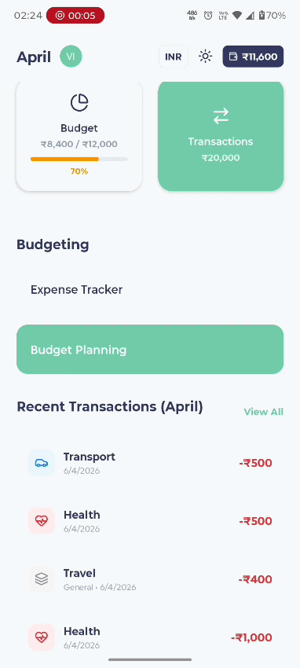

### 📱 App Preview (Light vs. Dark Mode)

| Feature | Light Mode | Dark Mode |
| :--- | :---: | :---: |
| **Dashboard** | 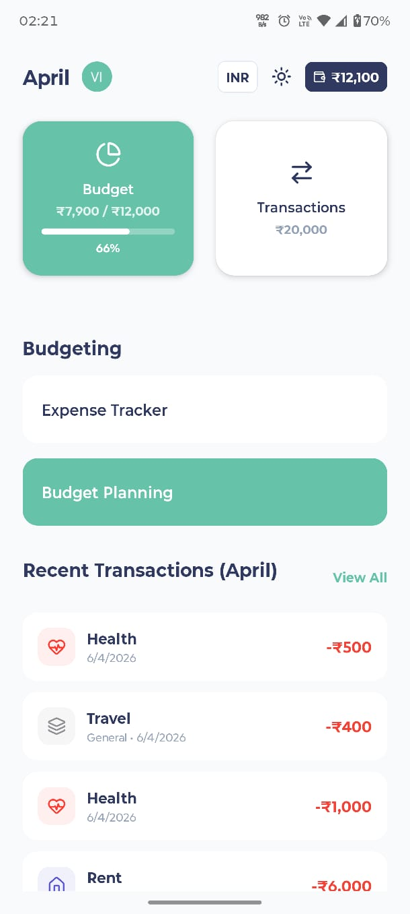 | 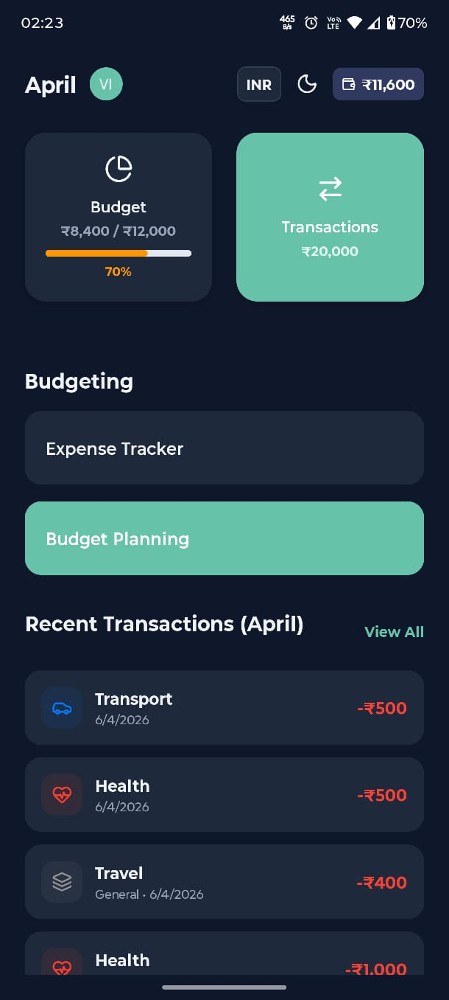 |
| **Budgeting** | 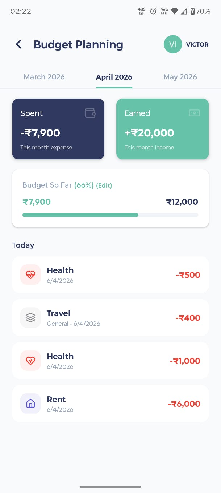 | 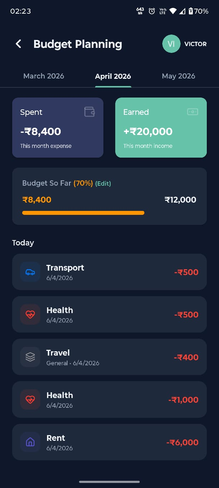 |
| **Analytics** | 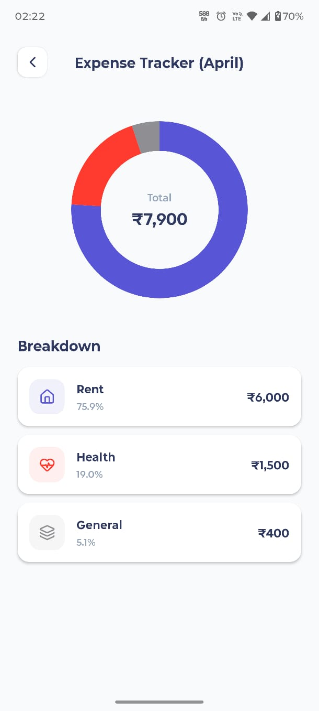 | 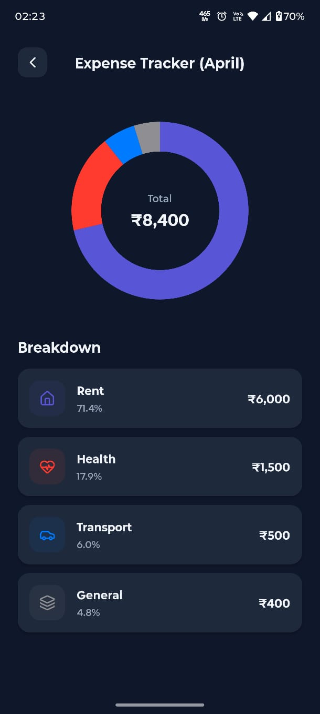 |
| **History** | 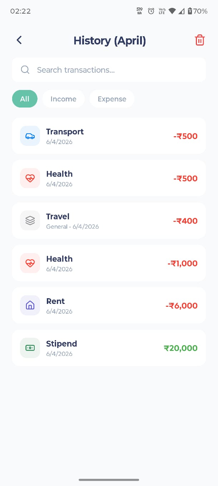 | 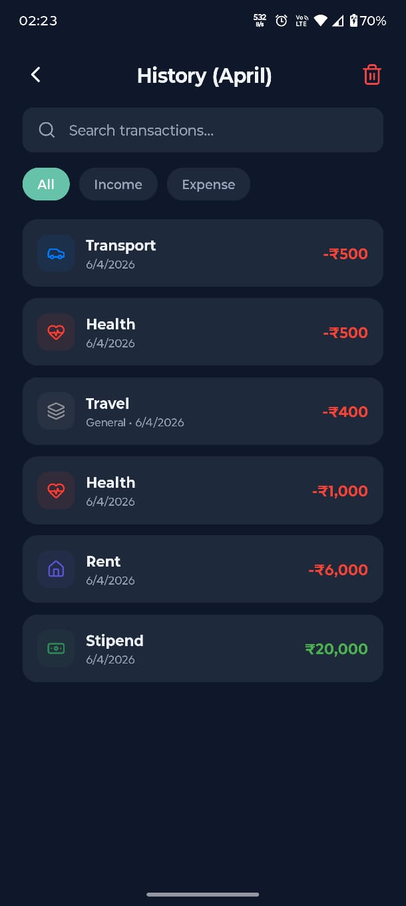 |

### 💸 Transaction Flow

| Expense Entry | Income Entry |
| :---: | :---: |
| 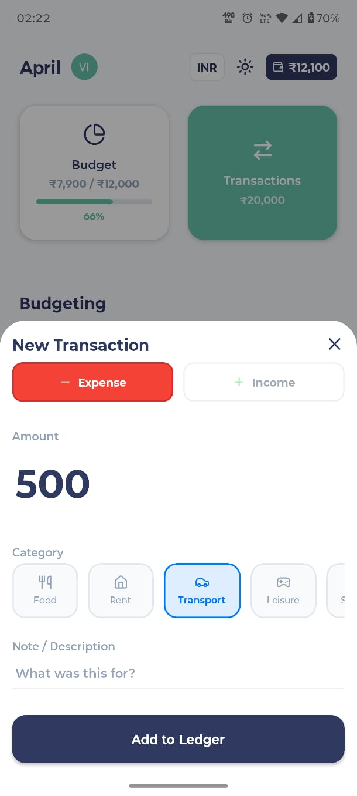 | 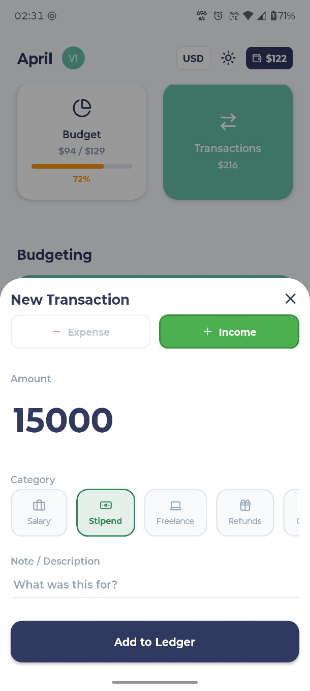 |

-----

### 📝 Project Overview

Wealthra is a mobile-first finance tracker designed to turn abstract spending into actionable daily habits. Moving away from the clutter of traditional banking apps, Wealthra focuses on a "high-frequency" user experience—making it effortless to log, track, and understand money in real-time.

-----

### 🚀 Core Requirements & Features

  * **Command Center Dashboard**: An informative overview featuring **Global Balance**, **Monthly Income**, and **Monthly Expenses**.
  * **Dynamic Light/Dark Mode**: A system-wide, professional theme toggle built with centralized semantic color mapping.
  * **Currency Value Engine**: Full support for **Indian Rupees (₹)** and **US Dollars ($)**. Unlike basic trackers, Wealthra performs real-time mathematical conversion of all historical transactions and budget limits when toggling currencies.
  * **Localization Polish**: Uses `Intl.NumberFormat` with the `en-IN` locale to ensure correct Indian numbering system comma placement (e.g., 1,00,000) for INR users.
  * **Dynamic "Time-Travel" Tracker**: A sophisticated month-to-month navigation system that updates all dashboard metrics based on the selected month.
  * **Insights Screen**: A dedicated section providing a **Category Breakdown** via a dynamic doughnut chart.
  * **Goal Feature: Smart Budgeting**: A budget limit tracker with a "Traffic Light" progress system (**Green** $\to$ **Orange** $\to$ **Red**).

-----

### 🛠️ Tech Stack & Architecture

  * **Framework**: React Native (Expo SDK 54) + **TypeScript**.
  * **State Management**: **Zustand** with **AsyncStorage** persistence.
  * **State Mapping**: Implemented a custom `setCurrency` action in the store that maps through the `transactions` array and `monthlyBudgets` record to maintain data integrity during currency shifts.
  * **Data Handling**: Utilizes a `monthKey` mapping strategy (`YYYY-MM`) to isolate budgets and transactions.

-----

### 💡 Product Thinking & Design Assumptions

In alignment with the assignment’s focus on "Reasonable Assumptions" and "Polish over Complexity," Wealthra implements:

1.  **Offline-First Currency Conversion**:
    To ensure the app remains functional in zero-connectivity environments (subways, travel), I implemented a fixed-rate conversion engine:
    $$1 \text{ USD} \approx 92.74 \text{ INR}$$
    **Trade-off**: While live APIs offer precision, a fixed rate ensures **instant UI feedback** and prevents "data flickering" caused by fluctuating rates, providing a more stable user experience.

2.  **The "Global Wallet" Logic**:
    While budgets "time-travel" per month, the **Balance Chip** remains a global sum, providing an immutable "Ground Truth" of actual cash-on-hand.

3.  **Traffic Light Budgeting**:
    To drive habit change, the progress bar shifts colors at specific thresholds: **Orange** at 70% and **Red** at 90% of the limit.

4.  **Zero-Friction Interaction**:
    Numeric-restricted fields and pre-selected categories reduce the "taps-to-task" ratio, encouraging high-frequency logging.

-----

### ⚙️ Setup Instructions

```bash
# 1. Clone the repository
git clone https://github.com/VictorLoucii/wealthra-finance-companion
cd wealthra-finance-companion

# 2. Install dependencies
npm install

# 3. Start the Expo server
npx expo start

# 4. Run on device/emulator
# Press 'a' for Android or 'i' for iOS in the terminal
```

-----

